# Introdução e Contexto Geral

O objetivo deste artigo será a apresentação dos conhecimentos adquiridos no primeiro desafio de projeto do Bootcamp Santander 2025 de Cibersegurança. O desafio trata-se da utilização da ferramenta Medusa para realização de Ataque de Força Bruta em alguns serviços vulneráveis da máquina alvo. 

A intenção é trazer os conceitos por de trás das ferramentas utilizadas como forma de sistematizar os conhecimentos adquiridos. Ressalto que, por não ser oriundo da área de Ciência da Computação, buscarei escrever de forma simples meus entendimentos dos conceitos utilizados.

O objetivo deste trabalho é percorrer o fluxo de ações a serem empregadas para a realização deste ataque. Para isso, utilizarei as seguintes ferramentas:

* [Kali Linux](https://www.kali.org/docs/introduction/what-is-kali-linux/#:~:text=Kali%20Linux%20(formerly,professionals%20and%20hobbyists.)): distribuição do Linux baseada no Debian específica para a realização de testes de invação e auditorias de segurança. O Kali já vem com diversas ferramentas instaladas, inclusive, o Medusa; 
* [Metasploitable2](https://sourceforge.net/projects/metasploitable/#:~:text=Metasploitable%20is%20an%20intentionally%20vulnerable%20Linux%20virtual%20machine.%20This%20VM%20can%20be%20used%20to%20conduct%20security%20training%2C%20test%20security%20tools%2C%20and%20practice%20common%20penetration%20testing%20techniques.): máquina virtual Linux intencionalmente vulnerável utilizada para a treinamento, testes de ferramentas de segurança e práticas de *pentest*;
* [nmap](https://nmap.org/man/pt_BR/): ferramenta de código aberto usada para exploração de redes e auditoria de segurança. Ela pode determinar os *hosts* disponíveis na rede, quais serviços estes *hosts* disponibilizam, os sistemas operacionais executados pelos *hosts*, dentre outros;
* [DVWA](https://github.com/digininja/DVWA) (*Damn Vulnerable Web Application*): aplicação *web* baseada em PHP e MariaDB intencionalmente vulnerável com a finalidade de treinamento;
* [protocolos FTP](https://datatracker.ietf.org/doc/rfc959/#:~:text=The%20objectives%20of,use%20by%20programs.): protocolo de rede cujo principal objetico é regulamentar a transferência de arquivos entre sistemas.

## Protocolo de Autenticação

Protocolo de autenticação é o processo que as aplicações *web* utilizam para confirmar que certo usuário poderá acessar ao conteúdo daquela aplicação *web*. Do ponto de vista do usuário, estes processos de autenticação são mais claros quando ele acessa um serviço por meio de suas credenciais (usuário e senha). Apesar disso, a validação do credenciamento do usuário é realizada a cada iteração deste com o sistema.

### Autenticação *Stateless*

Na autenticação *stateless*, após o usuário realizar o *login* no sistema, este recebe um *token* que contém todas as informações necessárias para validar o acesso do usuário em requisições futuras. Nenhuma informação sobre a existência da sessão do usuário na aplicação é armazenada.

Cada iteração do usuário com o sistema, do ponto de vista do servidor, é como se fosse a primeira.

Um exemplo de *token* utilizado é o JSON *Web Tokens*, [JWT](https://www.jwt.io/introduction#what-is-json-web-token). Este *token* é formado por três parcelas separadas por um ponto:
* *Header*: esta parcela é composta por duas parte, o tipo do *token*, neste caso, JWT, e o nome do algoritimo de assinatura, exemplo:

```
{
    "alg":HS256,
    "TYP":"JWT"
}
```

* *Payload*: esta parcela são as informações adicionais, as quais podem ser informações de registro, informações públicas ou informações privadas, veja o exemplo:
```
{
    "sub":"1234567890",
    "name":"John Doe",
    "admin":true,
}
```
* *Signature*: esta parcela recebe como entrada as duas parcelas anteriotes, *Header* e o *Payload*, e uma chave (*secret*). A saída será a criptografia dos três valores de entrada:
```bash
HMACSHA256(
    base64UrlEncode(header) + "." +
    base64UrlEncode(payload),
    secret)
``` 

O resultado das três parcelas unidas é uma chave criptografada que pode ser facilmente passada do cliente para o servidor com fins de autenticação do usuário. A seguir, uma imagem exemplo desta chave retirada da documentação do JWT:

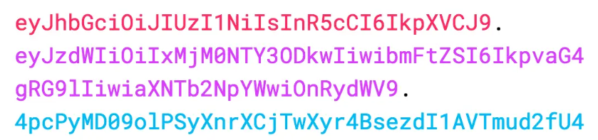

### Autenticação *Statefull*

Na autenticação *stateful* as informações de sessão de um usuário após o *login* devem ser armazenadas. Ou seja, o servidor deve possuir um histórico das requisições realizadas pelo usuário durante a sessão. Este tipo de autenticação pode ser utilizada, por exemplo em serviços de e-mail ou serviços bancários.

Um exemplo de autenticação *stateful* é o [*Opaque Token*](https://docs.secureauth.com/ciam/en/opaque-token--concept,-purpose,-way-it-works.html#:~:text=Opaque%20Token%20Is-,The%20opaque%20token%20is%20a%20random%20unique%20string%20of%20characters%20issued,resource%20server%20calls%20the%20authorization%20server%20and%20requests%20the%20token%20introspection.,-With%20opaque%20tokens). Ele é *stateful*, pois, diferentemente do JWT, ele não carrega nenhuma informação no *token* em si.

Como vimos anteriormente, o JWT possui três informações criptografadas: *header*, *payload* e *signature*. Estas informações são descriptografadas no servidor de autorização que não armazena nenhuma informação da sessão do usuário.

Já o *Opaque Token* funciona como uma chave. Quando o usuário faz o *login* no sistema, ele recebe o *Opaque Token*, que é uma *string* de caracteres aleatórios e únicos. Então, de posse desta chave (que não possui nenhuma informação das credenciais ou do usuário), o usuário pode realizar requisições aos outros serviços do sistema. 

Quando um serviço recebe uma requisição junto com o *token*, ele não consegue permitir acesso, pois o *token* em si não possui nenhuma identificação de quem é o usuário. Desta forma, o serviço faz uma consulta ao servidor de autorização *stateful* que emitiu o *token* (e armazena informações de sessão do usuário) e realiza uma *token introspection*. 

A *token introspection* nada mais é que uma requisição ao servidor de autorização solicitando informações como: validade do *token*, o nome do usuário, permissões deste usuário, data de expiração, entre outros.

Observe que, neste caso, as informações solicitadas na *token introspection* estão armazenadas no servidor de autorização. Esta é a definição da autenticação *stateful*.

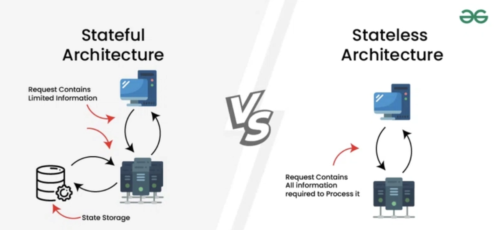

### Autenticação Federada

O processo de autenticação federada é quando o serviço de autenticação de uma aplicação *web* é terceirizada a um provedor de identidades confiável. Um exemplo deste tipo de autenticação é o acesso a algumas aplicações via conta do *Google*. Neste caso, o *Google* é o provedor de identidades confiável.

# Ataque de Força Bruta

Ataques de força bruta são ataques que não exploram diretamente uma vulnerabilidade do sistema, mas sim, vazamento de senhas ou a utilização de senhas fracas pelos usuários ou desenvolvedores do sistema. A seguir, apresenta-se alguns destes ataques:
* Ataque de força bruta: parte da utilização de um conjunto de credenciais vazadas para tentar acesso a sistemas. Uma forma de impedir este tipo de ataque é limitar o número de tentativas de login do usuário;
* Ataque de força bruta pura (com permutação): este ataque não parte de uma lista de credenciais (*wordlist*), mas sim da combinações de caracteres. Este ataque se torna ineficaz se as senhas forem muito grandes ou complexas; e
* Ataque híbrido (managing rules): parte de uma *wordlist*, mas faz alterações que os humanos costumam fazer, exemplo, a senha "primeiro" se tornaria "pr1m31r0".

Outros ataques mais sofisticados são o *password spraying* e o *credential stuffing*:
* *Password Spraying*: neste ataque, em vez de se tentar várias senhas para um mesmo usuário, tenta-se a mesma senha para diversos usuários. Imagine que o atacante teve acesso à lista de e-mails de uma empresa. Ele pode, por exemplo, tentar *logar* no sistema com todos os e-mails utilizando a senha padrão "123456". Este ataque é mais sofisticados pois não alarma sistemas que são programados para bloquear o acesso após certo número de erro da senha; e
* Credential Stuffing: neste ataque, o atacante utiliza um conjunto de credenciais vazadas na internet para tentar acessar outros sistemas. Imagine que as credenciais do LinkedIn de um usuário vazaram. A estratégia é usar estas credenciais para tentar acesso a outros sistemas como Facebook ou Instagram.

## Configuração do Ambiente

Quanto ao processo de instalação do *Oracle VirtualBox* e das imagens iso do Kali e do Metasploitable2, isto não será discutido aqui. 

A única informação importante para a realização dos procedimentos a seguir é que ambas as máquinas deverão ser configuradas para estarem na rede local (*host-only*). Isto é configurado da seguinte forma:
1. Clique com o botão direito nas máquinas (ainda no *Oracle VirtualBox*) e acesse as configurações de cada máquina;
2. Acesse o menu "Rede"; e
3. Defina "Ligado a" como "Placa de rede exclusiva de hospedeiro (host-only)".

## Primeiros Contatos com Metasploitable2

O primeiro objetivo será a identificação do IP da máquina alvo. De acordo com a [documentação](https://nmap.org/book/man-target-specification.html#:~:text=Sometimes%20you%20wish%20to%20scan%20a%20whole%20network%20of%20adjacent%20hosts.%20For%20this%2C%20Nmap%20supports%20CIDR%2Dstyle%20addressing.%20You%20can%20append%20/%3Cnumbits%3E%20to%20an%20IP%20address%20or%20hostname%20and%20Nmap%20will%20scan%20every%20IP%20address%20for%20which%20the%20first%20%3Cnumbits%3E%20are%20the%20same%20as%20for%20the%20reference%20IP%20or%20hostname%20given.) do nmap, "*sometimes you wish to scan a whole network of adjacent hosts. For this, Nmap supports CIDR-style addressing. You can append /\<numbits\> to an IP address or hostname and Nmap will scan every IP address for which the first \<numbits\> are the same as for the reference IP or hostname given*".

A intenção, então, será descobrir a máscara de rede e escanear todos os IPs desta rede usando a notação *CIDR-style addressing*. Apenas para fins de exemplo, suponha que o endereço de rede seja "192.168.1.0" e a mascará de rede seja "255.255.255.0". A notação CIDR, "192.168.1.0/24", quer dizer que os primeiros 24 bits do endereço, três octetos iniciais, são fixos.

Utilizando esta notação junto com o nmap torna-se possível escanear a rede em busca do nosso alvo. Observe na figura abaixo que a nossa máscara de rede é 192.168.56.0 (*eth0*), pois os primeiros 24 bits (3 octetos) são fixos (192.168.56.103/24):

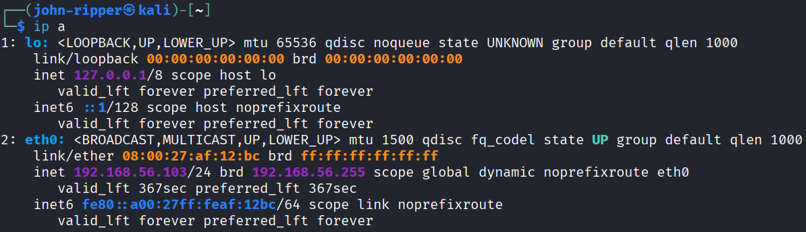

Agora, basta varrer a rede utilizando o seguinte comando:
```bash
nmap -sn 192.168.56.0/24
```

Ressalta-se que, de acordo com a documentação, a *flag -sn* configura o nmap para realizar apenas uma varredura dos *hosts* da rede, desabilitando o escaneamento das portas.

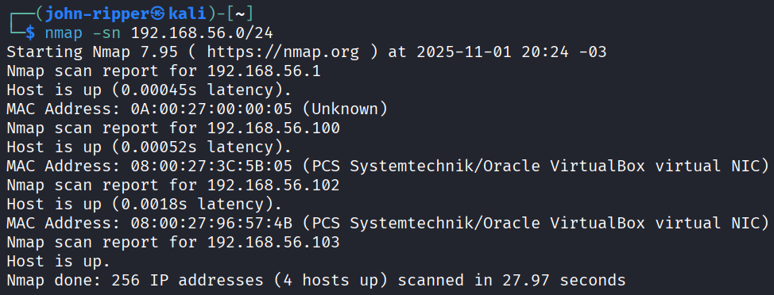

Quatro IPs foram encontrados na saída comando executado acima: **192.168.56.1**, **192.168.56.100**, **192.168.56.102**, **192.168.56.103**. O primeiro IP de uma rede é sempre reservado para a identificação desta rede e o IP de final 103 é o IP da minha máquina Kali. Logo, os IPs final 100 e 102 serão analisados. 

Para análise de ambos IPs será utilizado o comando a seguir. A *flag -sV* configurará o nmap para escanear todas as portas do IP alvo, trará informações dos serviços disponíveis nestas portas e infomações do sistema operacional rodando no IP alvo:

```bash
nmap -sV 192.168.56.100
nmap -sV 192.168.56.102
```

A seguir, o resultado obtido no IP **192.168.56.100**:

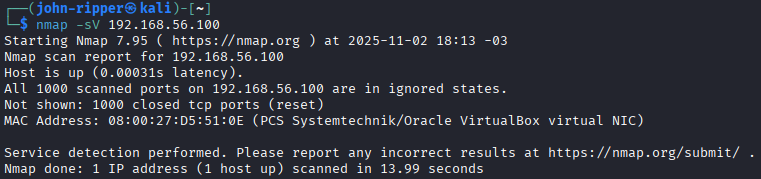

A seguir, o resultado obtido no IP **192.168.56.102**:

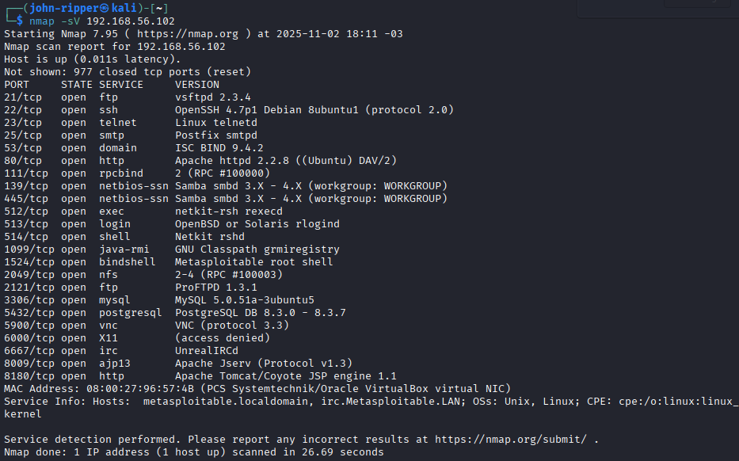

Analisando as duas saídas, concluiu-se que o IP da máquina alvo, Metasploitable2, é **192.168.56.102**.Isto é confirmado pelo resultado do comando ```ip a``` na Metasploitable2:

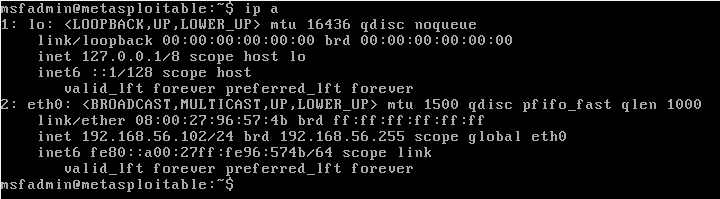

## Protocolo FTP

Após o escaneamento e descoberta da máquina alvo, observe que o serviço FTP está disponível e aberto na porta 21. Uma das etapas do desafio será um ataque de força bruta em FTP. Antes da realização do ataque, porém, será feita uma breve descrição deste serviço.

De acordo com a [documentação](https://www.commandlinux.com/man-page/man1/ftp.1.html#:~:text=Ftp%20is%20the%20user%20interface%20to%20the%20Internet%20standard%20File%20Transfer%20Protocol.%20The%20program%20allows%20a%20user%20to%20transfer%20files%20to%20and%20from%20a%20remote%20network%20site.), o protocolo FTP serve para transferir arquivos entre um cliente e um servidor via internet.

## *Wordlists*

Para os ataque a serem efetuados, será necessário a utilização de um lista de credenciais comuns. O vazamento de credenciais é uma ocorrência muito comum e estas credenciais alimentam o banco de dados a ser utilizado pos ferramentas como o Medusa.

Um dos casos mais importantes de vazamentos de credenciais foi a lista de palavras **RockYou.txt*. Este vazamento ocorreu em 2009 quando a empresa de publicidade e aplicativo social, *RockYou*, sofreu um ataque cibernético que levou à exposição de mais de 32 milhões de senhas de usuários.

Para este ataque, serão utilizadas duas listas bem simples de usuários e senhas: *user.txt* e *pass.txt*. Estas listas serão criadas com os comandos a seguir:

```bash
echo -e "users\nmsfadmin\nadmin\nroot" > users.txt
echo -e "123456\npassword\nqwerty\nmsfadmin" > pass.txt.
```

Para fins de informação, havendo a necessidade de *wordlists* mais completas, o Kali possui salvo no caminho abaixo diversas *wordlists* (inclusive a *rockyou.txt*) que podem ser usadas para ataques:

```bash
/usr/share/wordlists/
```

## Ataque de Força Bruta no FTP com Medusa

Dito isto, será simulado um ataque de força bruta no serviço FTP (disponível na porta 21) da máquina alvo:

```bash
medusa -h 168.168.56.102 -U users.txt -P pass.txt -M ftp -t 6
```

A seguir, apresenta-se o significado de cada uma das *flags* que acompanham o comando acima de acordo com a documentação do Medusa:
* *-h*: *Target hostname or IP address*;
* *-U*: esta *flag* configura o Medusa para *Reads target usernames from the file specified rather than from the command line. The file should contain a list separated by newlines*;
* *-P*: esta *flag* faz o mesmo que a anterior, porém relacionado ao arquivo com os *passwords*;
* *-M*: *Name of the module to execute*, neste caso, o protocolo FTP;
* *-t*: *Total number of logins to be tested concurrently*, ou seja, a quantidade total de *logins* simultâneos que serão realizados. Dependendo da quantidade de requisições simultâneas forem feitas, este pode se tornar um Ataque de Negação de Serviço, *Deniel of Service* (DoS).

O resultado do comando acima foi um par (usuário e senha) de credenciais obtidas: **msfadmin** (usuário) e **msfadmin** (senha):

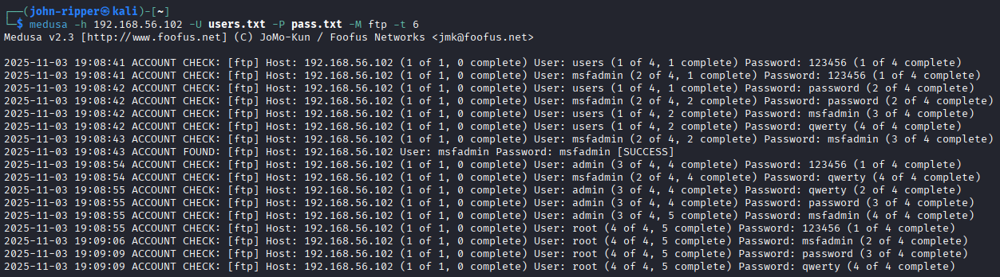

Apos serem obtidas, as credenciais foram usadas para acessar o serviço e, já dentro do sistema, tentou-se baixar os arquivos de configuração **passwd** e **shadow**. Estes arquivos ficam armazenados na pasta **etc** da raiz do linux e possuem informações de usuários e *hash* de senhas. Os comando a seguir foram utilizados:

```bash
binary
get /etc/passwd
get /etc/shadow
```

O arquivo **passwd** foi baixado normalmente, mas o **shadow**, não. O insucesso no *download* do *shadow* possivelmente é devido a restrições de acesso do usuário utilizado.

Como nova estratégia para tentar escalar o acesso, utilizarei o arquivo **passwd** para criar uma nova lista de usuários e usarei uma lista de senhas mais robusta para ver se alcanço algum resultado novo. A seguir, o comando utilizado para isolar apenas os nomes de usuário do arquivo *passwd*:

```bash
cut -d ':' -f 1 passwd > users_new.txt
```

Em linhas gerais, o comando acima define o delimitador que irá separar a linha ("-d :"), define o termo que será saldo ("-f 1"), define o arquivo a ser analisado ("*passwd*") e salva o resultado em um arquivo novo (*users_new.txt*). A seguir, apresenta-se a nova tentativa de obtenção de credenciais, mas desta vez, usando os *usernames* obtidos na primeira exploração e usando as senhas do famoso arquivo *rockyou.txt*:

```bash
medusa -h 168.168.56.102 -U users_new.txt -P /usr/share/wordlists/rockyou.txt -M ftp -t 6
```

Devido a sucessivas falhas da máquina virtual Kali e à demora no processamento, não foram obtidas respostas no código acima.

## Exploração do Formulário *Web* (DVWA)

Para a exploração do DVWA, antes de tudo é importante saber como o formulário funciona: quais dados são enviados do *frontend* para o *backend*, qual a mensagem surge quando o *login* falha, entre outros. Para isso, é essencial usar ferramenta de desenvolvedor do navegador apertando a tecla F12 ou simplesmente verificar o código fonte da página HTML.

Ao analisar o código fonte da página, observe que o usuário é alocado na variável *username*, a senha, na variável *password* e o botão de *submit*, na variável *Login*:

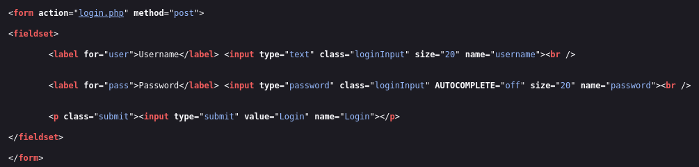

Observe também que a mensagem retornada pelo formulário em caso de falha é *Login failed*:

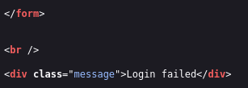

Sendo "honesto", não seria nem necessário realizar o ataque usando o Medusa, tendo em vista que no código fonte da página já há uma dica sobre as credenciais de acesso (*admin* e *password*):

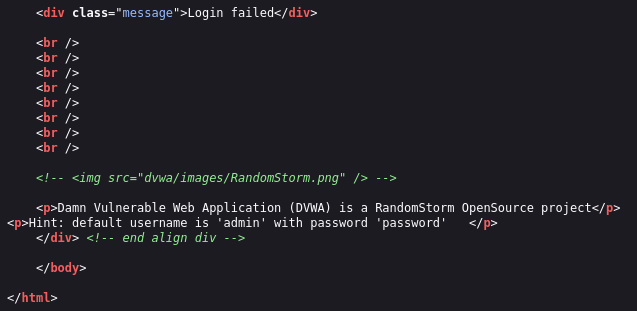

O comando utilizado para a realização do ataque com o Medusa foi o seguinte:

```bash
medusa -h 192.168.56.102 -U users.txt -P pass.txt -M http -m PAGE:'/dvwa/login.php' -m FORM:'username=^USER^&password=^PASS^&Login=Login' -m 'FAIL=Login failed' -t 6 
```

Todos as *flags* acima já foram explicadas, exceto a *flag -m*. De acordo com a documentação do Medusa, esta *flag* define parâmetros diversos a serem definidos no ataque. Ela pode ser inserida múltiplas vezes com parâmetros diferentes e todos eles serão passados para o programa para a realização do ataque.

## *Password Spraying* em SMB com Enumeração de Usuários

# Conclusão

# Referências
